# Just Another Database GUI

A keyboard-first database GUI. Go core, React UI in a native webview, one binary.
Built as a replacement for TablePlus.

**MySQL / MariaDB · PostgreSQL · SQL Server · SQLite**

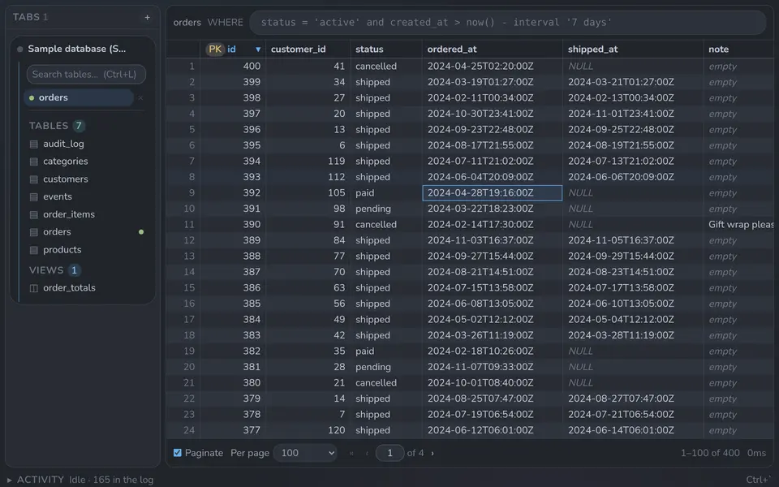

## Try it

Download `ja-db.exe` from the [latest release](https://github.com/Cleancookie/ja-db/releases/latest)
and run it. There is no installer. It checks for new versions and updates itself.

No database handy? Click **Open the sample database** on the first screen. It is a
small shop (customers, orders, a 6,000-row `events` table) in a SQLite file.

## Features

### 1. Palette first

There is no menu bar. `Ctrl+P` goes somewhere — a table, a database, a tab.
`Ctrl+Shift+P` does something — every command, with its shortcut beside it. Both
match fuzzily and rank what you use most.

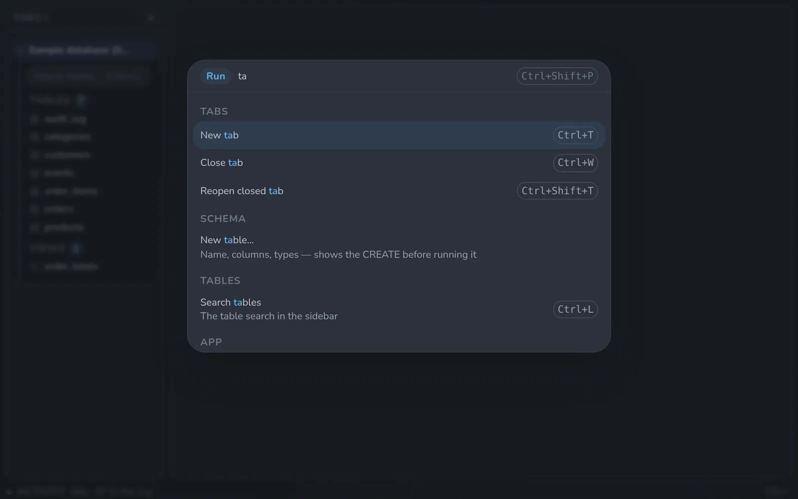

### 2. Built for big tables

Rows come a page at a time, or scroll in as you go. Long text and JSON columns are
cut short by the *database*, so a 5 MB value never crosses the wire until you open
that one cell. A raw SQL `WHERE` box (`Ctrl+F`) narrows the rows before they are
fetched.

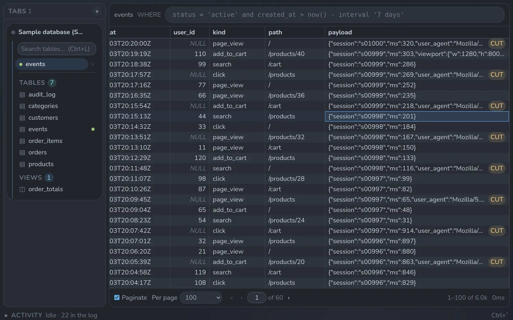

### 3. JSON viewer and editor

`Enter` on a cell opens its full value. JSON becomes a collapsible tree you can
edit in place. Saving changes only the keys you touched, not the whole document.

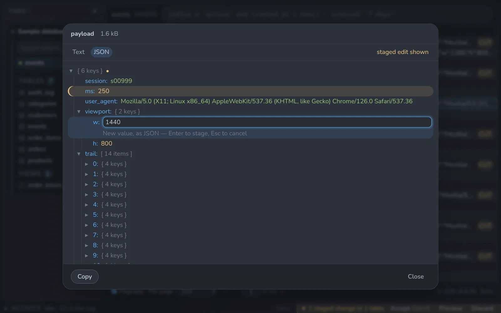

### 4. Activity log

Every query the app runs — yours and its own — is listed with its timing and row
count. Running ones show live, and can be cancelled. `` Ctrl+` `` opens the tray.

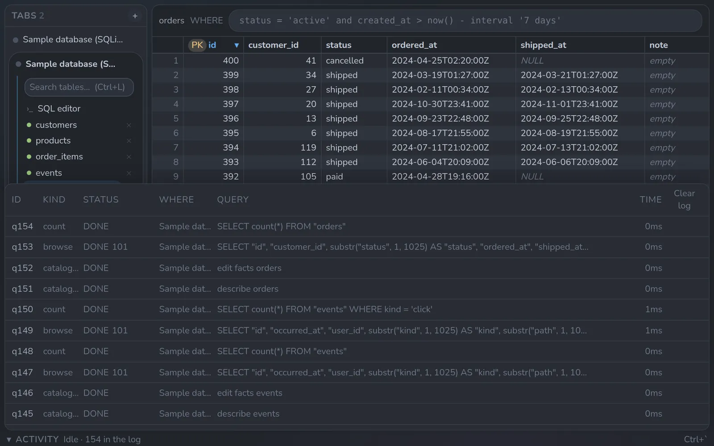

### 5. Review before you write

Edits in the grid are staged, not sent. `Ctrl+S` shows the exact SQL that will run,
across every table you touched. Run it, or back out.

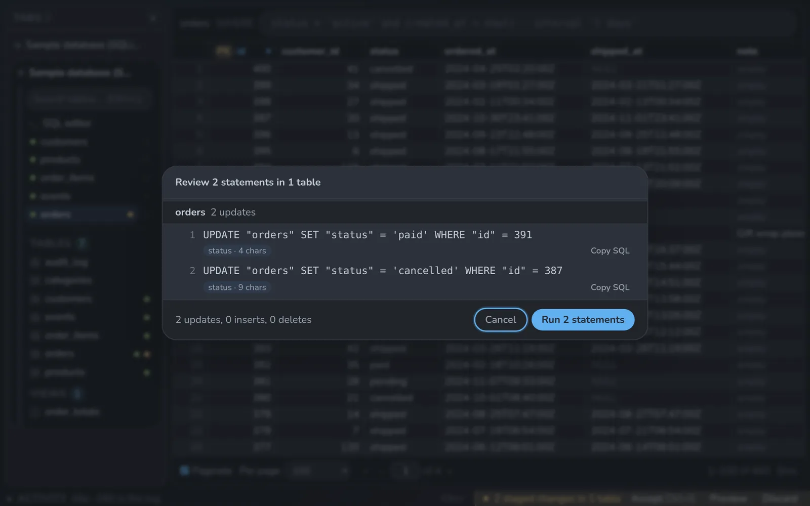

### 6. Four databases

MySQL / MariaDB, PostgreSQL, SQL Server and SQLite, behind one interface. TLS is
verified by default for any server off this machine. Passwords live in the OS
keyring.

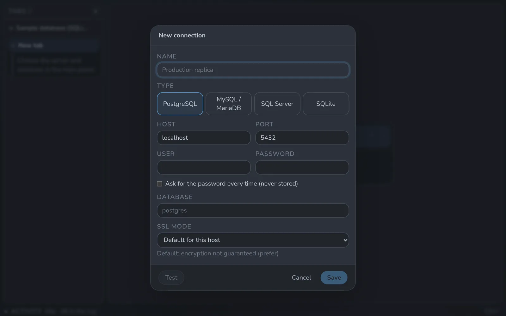

## Themes

Eight, switched from Settings (`Ctrl+,`). One Dark is the default.

| | |
| --- | --- |
|  One Dark | 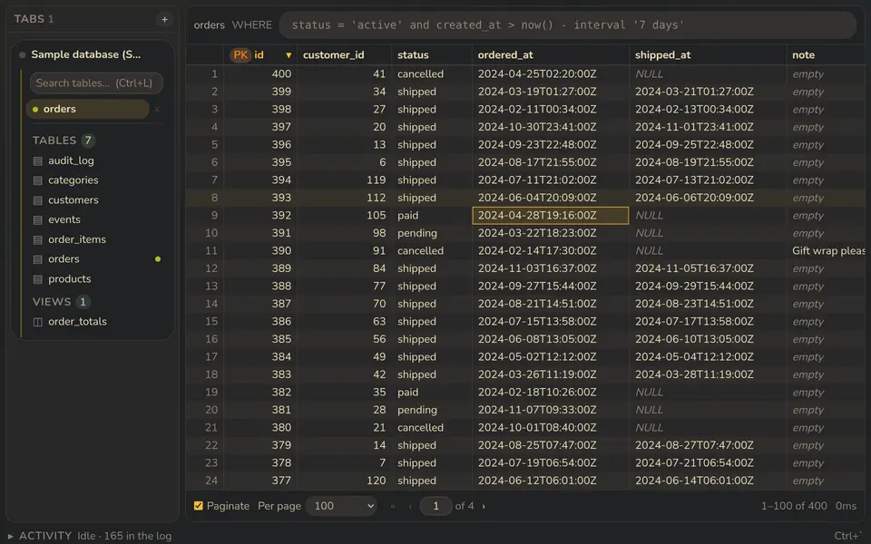 Gruvbox Dark |
| 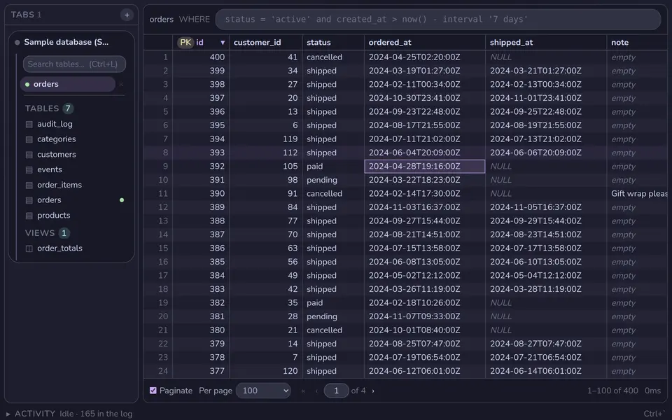 Catppuccin Mocha | 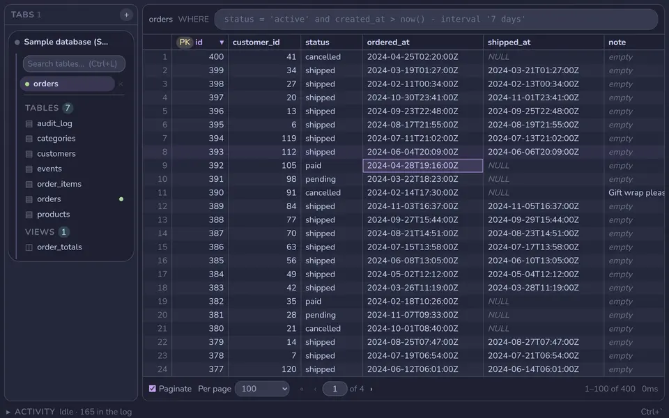 Catppuccin Macchiato |
| 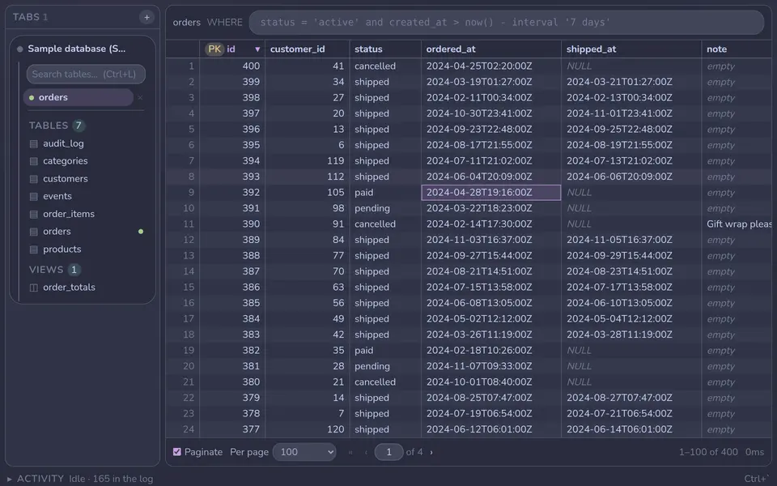 Catppuccin Frappé | 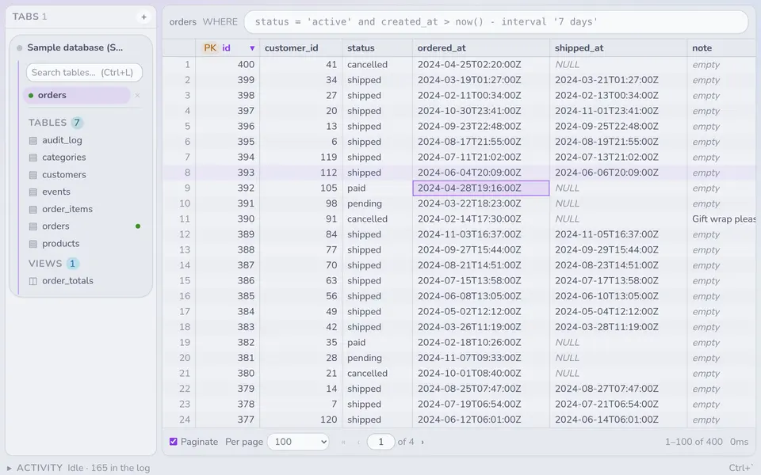 Catppuccin Latte |
| 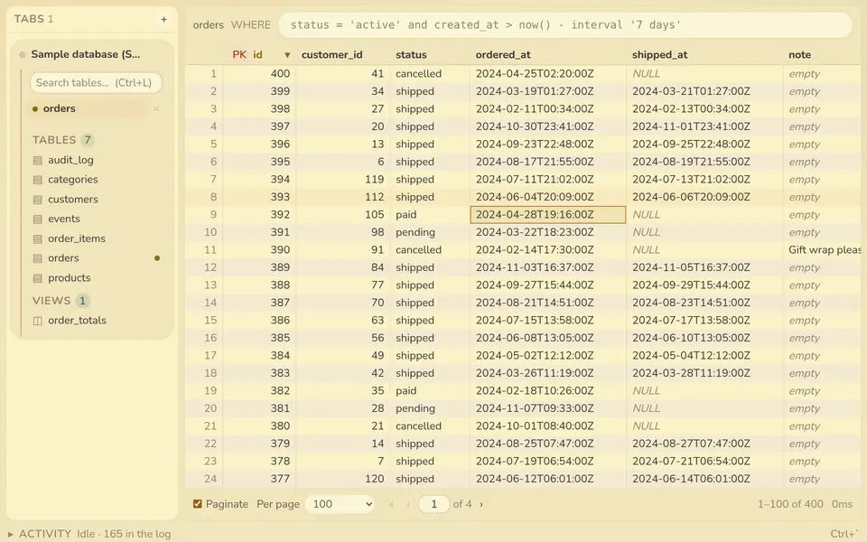 Gruvbox Light | 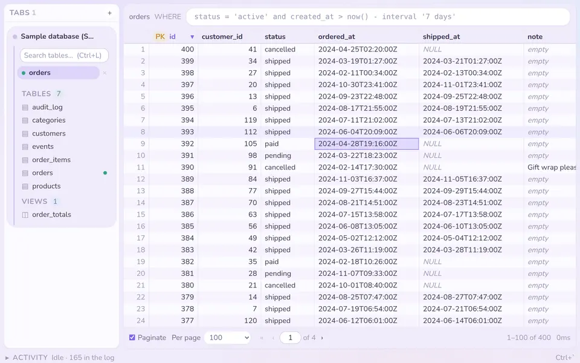 Sherbet |

## Keys

| Key | Action |
| --- | --- |
| `Ctrl+P` / `Ctrl+Shift+P` | Go-to palette / command palette |
| Arrows, `Ctrl+H` `Ctrl+J` `Ctrl+K` | Move a cell in the grid |
| `Ctrl+F` | Focus the `WHERE` filter |
| `Ctrl+L` | Search tables |
| `Ctrl+E` | Toggle SQL editor |
| `Ctrl+Enter` | Run query |
| `Ctrl+R` | Refresh |
| `Ctrl+T` / `Ctrl+W` / `Ctrl+Shift+T` | New / close / reopen tab |
| `Ctrl+B` or `Ctrl+←` / `` Ctrl+` `` or `Ctrl+↓` | Toggle the left / bottom pane |
| `Ctrl+S` | Review staged changes |
| `Enter` | Open the selected cell |
| `Esc` | Close palette or dialog |

The full list: `Ctrl+Shift+P` → "Keyboard shortcuts".

## Running from source

The Go core is transport-agnostic. A dev HTTP server exposes exactly the API the
Wails bindings do, so it runs anywhere — including WSL with no native webview.

```sh
make dev   # terminal 1 — Go API on :34567
make web   # terminal 2 — Vite on :5173, proxying /api to the above
```

Open <http://localhost:5173>.

```sh
make windows   # -> build/bin/ja-db.exe
make check     # fmt, vet, typecheck, tests
make           # every target
```

For a native window with hot reload, run `wails dev`. On Linux it needs
`webkit2gtk-4.1` and `libgtk-3-dev`. Windows needs the WebView2 runtime (present on
Windows 11 and any updated Windows 10).

## Where things live

See [ARCHITECTURE.md](ARCHITECTURE.md). The short version:

```
internal/driver/    one file per dialect, behind a single Driver interface
internal/config/    connections and settings on disk
internal/engine/    live connections + query execution
internal/api/       the whole API surface, called by both transports
app.go              Wails binding — a thin pass-through to internal/api
cmd/devserver/      HTTP binding — the same, over JSON
frontend/           React + TS + Vite + Tailwind
```

- [docs/REQUIREMENTS.md](docs/REQUIREMENTS.md) — what was asked for, what was
  decided, and the invariants that must not regress
- [docs/WISHLIST.md](docs/WISHLIST.md) — wanted, not yet built
- [docs/adr/](docs/adr/) — decisions and why

## Committing

Subjects start with one of four emoji, which names the size of the change and
sets the next version. Convention only — nothing enforces it.

| | | |
| --- | --- | --- |
| 🔥 | breaking change | major |
| ✨ | new capability | minor |
| 🛠️ | minor change — refactor, docs, tooling | minor |
| 🐛 | bug fix | patch |

```
✨ Add SQL autocomplete to the filter box and the editor
🐛 Stop Enter in the filter box opening the cell viewer
```

Rationale in
[docs/adr/0004-commit-message-convention.md](docs/adr/0004-commit-message-convention.md).

## Credential storage

Passwords go in the OS keyring: Windows Credential Manager, macOS Keychain or the
Linux Secret Service. That protects them from other users of the machine. It does
not protect them from malware running as you.

**If no keyring is available** (often WSL or a bare Linux box) passwords fall back to
plain text in `secrets.json` under your user config directory. The app says so in a
banner that stays up. On a throwaway dev machine that may be fine; anywhere else,
tick "Ask for the password every time" on the connection and nothing is stored.

`connections.json` (hosts, users, database names) and a connection's extra `params`
are always plain text. Do not put secrets in `params`.

See [docs/adr/0007-credential-storage.md](docs/adr/0007-credential-storage.md).
